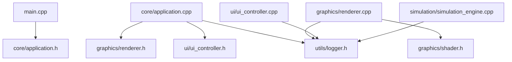

# Heat Sim Project Structure

## Overview
The Heat Sim project follows a modular architecture with clear separation of concerns. Each component is organized into its own directory within the `src` folder.

## Directory Structure

```
HeatSim/
├── build/                      # Build output directory
│   └── bin/                    # Executable output
│       └── HeatSim
├── docs/                       # Documentation
│   ├── heat_sim_project_overview.md
│   ├── phase1_summary.md
│   ├── project_structure.md
│   └── roadmap.md
├── include/                    # External headers
│   └── glad/                   # OpenGL loader
│       └── glad.h
├── shaders/                    # GLSL shader files
│   ├── rod.frag               # Fragment shader for temperature visualization
│   └── rod.vert               # Vertex shader for rod geometry
├── src/                        # Source code
│   ├── core/                   # Core application logic
│   │   ├── application.cpp     # Main application class
│   │   └── application.h
│   ├── graphics/               # Rendering and visualization
│   │   ├── renderer.cpp        # OpenGL renderer
│   │   ├── renderer.h
│   │   ├── shader.cpp          # Shader compilation and management
│   │   └── shader.h
│   ├── io/                     # Input/Output and file operations
│   │   └── glad.c              # OpenGL function loader
│   ├── simulation/             # Physics simulation (Phase 2)
│   │   ├── simulation_engine.cpp  # Heat simulation logic
│   │   └── simulation_engine.h
│   ├── ui/                     # User interface
│   │   ├── ui_controller.cpp   # ImGui panels and controls
│   │   └── ui_controller.h
│   ├── utils/                  # Utility classes
│   │   ├── logger.cpp          # Logging system
│   │   └── logger.h
│   ├── common.h                # Common includes and constants
│   └── main.cpp                # Entry point
├── assets/                     # Resources (fonts, textures)
│   └── fonts/                  # Font files for UI
├── CMakeLists.txt             # CMake build configuration
├── Makefile                   # Make wrapper for build commands
├── README.md                  # Project readme
├── requirements.txt           # System requirements
├── heatsim.log               # Application log file
└── .gitignore                # Git ignore file
```

## Module Descriptions

### Core (`src/core/`)
**Purpose**: Application lifecycle and coordination
- **application.h/cpp**: Main application class managing window, update loop, and component coordination
- Responsibilities:
  - GLFW window management
  - Main game loop
  - Component initialization
  - Event handling

### Graphics (`src/graphics/`)
**Purpose**: All rendering and visualization
- **renderer.h/cpp**: OpenGL rendering pipeline
  - Manages VAO/VBO/EBO
  - Temperature-to-color mapping
  - Rod geometry generation
- **shader.h/cpp**: Shader compilation and uniform management
  - GLSL shader loading
  - Program linking
  - Uniform setters

### UI (`src/ui/`)
**Purpose**: User interface and controls
- **ui_controller.h/cpp**: ImGui-based control panels
  - Simulation parameters
  - Material presets
  - Performance metrics
  - Visual settings

### Simulation (`src/simulation/`)
**Purpose**: Physics and heat transfer calculations
- **simulation_engine.h/cpp**: Heat diffusion simulation
  - Finite difference solver
  - Boundary conditions
  - Material properties
  - Currently CPU-based (CUDA in Phase 2)

### Utils (`src/utils/`)
**Purpose**: Utility and helper classes
- **logger.h/cpp**: Logging framework
  - Color-coded console output
  - File logging
  - Multiple log levels

### IO (`src/io/`)
**Purpose**: Input/output operations
- **glad.c**: OpenGL function loading
- Future: File I/O, configuration loading

## Include Dependencies



## Build System

### CMake Configuration
The project uses CMake with automatic dependency fetching:
- **GLM**: Mathematics library (fetched)
- **ImGui**: User interface (fetched)
- **GLFW**: Window management (system)
- **OpenGL**: Graphics API (system)

### Source Organization in CMakeLists.txt
```cmake
set(SOURCES
    src/main.cpp
    src/core/application.cpp
    src/graphics/renderer.cpp
    src/graphics/shader.cpp
    src/ui/ui_controller.cpp
    src/utils/logger.cpp
    src/io/glad.c
)
```

## Coding Standards

### File Naming
- All source files use lowercase with underscores: `file_name.cpp`
- Header files match their implementation: `file_name.h`
- Class names use PascalCase: `ClassName`

### Include Order
1. Corresponding header (for .cpp files)
2. Project headers (relative paths)
3. External library headers
4. Standard library headers

Example:
```cpp
#include "renderer.h"              // Own header
#include "shader.h"                 // Same module
#include "../utils/logger.h"       // Other module
#include <glad/glad.h>             // External library
#include <iostream>                // Standard library
```

### Namespace Usage
- Project constants in `HeatSim` namespace
- No `using namespace` in headers
- Minimal `using` declarations in implementation files

## Future Additions

### Phase 2: CUDA Integration
```
src/
├── cuda/                       # CUDA kernels and GPU code
│   ├── heat_kernels.cu
│   ├── cuda_manager.h
│   └── cuda_manager.cpp
```

### Phase 3: Advanced Features
```
src/
├── data/                       # Data export and analysis
│   ├── csv_exporter.h
│   └── data_analyzer.h
├── visualization/              # Advanced visualization
│   ├── graph_renderer.h
│   └── heatmap_generator.h
```

## Benefits of This Structure

1. **Modularity**: Each component has a clear purpose and location
2. **Scalability**: Easy to add new modules without affecting existing code
3. **Maintainability**: Related code is grouped together
4. **Testability**: Modules can be tested independently
5. **Collaboration**: Clear boundaries for parallel development
6. **Build Performance**: Minimal recompilation on changes

## Development Guidelines

### Adding New Features
1. Identify the appropriate module
2. Create files in the correct directory
3. Update CMakeLists.txt
4. Follow include path conventions
5. Update this documentation

### Module Communication
- Use interfaces/abstract classes for loose coupling
- Pass data through well-defined APIs
- Minimize cross-module dependencies
- Use the common.h for shared constants

---

*Last Updated: Phase 1 Completion*
*Version: 1.0.0*